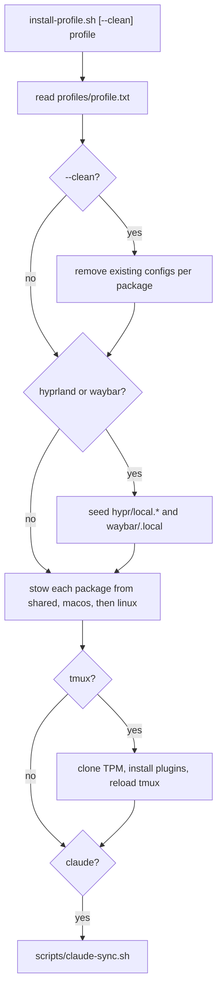

# Install profiles

How `install-profile.sh` turns a profile name into a fully linked machine.

## Why

Each machine type needs a different set of packages, plus setup that a symlink alone cannot do (tmux plugins, per-machine monitor files, Claude Code plugins).
One idempotent command covers a new machine and every later update.

## How it works

- Profiles are plain lists of package names; `#` comments and blank lines are ignored.
- `macos` and `arch-hyprland` share the core tools; `server` is zsh, nvim, tmux, claude, agents.
- A name missing from all three platform dirs is skipped with a warning, not an error.

## Tech

- Bash, GNU Stow, git (TPM clone), `scripts/claude-sync.sh`.

## Key files

- `install-profile.sh` - the installer
- `profiles/macos.txt` - macOS development machines
- `profiles/arch-hyprland.txt` - Arch + Hyprland desktop
- `profiles/server.txt` - headless servers

## Decisions and gotchas

- `--clean` deletes configs per package via a `case` in `remove_existing_configs`; a new package needs its own case.
  It keeps `~/.config/tmux/plugins` so plugins are not re-cloned on every run.
- TPM is untracked (no nested git repos), and `tmux.conf` fails silently without it, so the installer clones it.
- Machine-local files are seeded before stow so they get linked in the same pass, and existing ones are never overwritten.
- Updating a machine: `git -C ~/dotfiles pull --autostash`, then re-run the installer without `--clean`.

## Related

- [Stow layout](stow-layout.md)
- [Hyprland desktop](hyprland-desktop.md)
- [Claude Code](claude-code.md)
